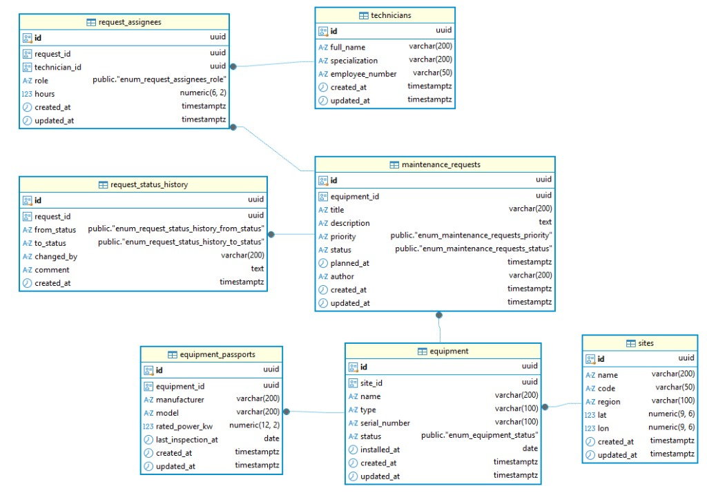

# База данных

PostgreSQL. Схема меняется только миграциями Sequelize (`src/db/migrations/`), без `sync({ force: true })`.

## ER-диаграмма



Файл: [`er-diagram.jpg`](er-diagram.jpg).

## Таблицы

| Таблица | Назначение |
|--------|-------------|
| `sites` | Площадки |
| `equipment` | Оборудование (FK → `sites`) |
| `equipment_passports` | Паспорт оборудования 1:1 (FK → `equipment`) |
| `technicians` | Техники |
| `maintenance_requests` | Заявки на ТО (FK → `equipment`) |
| `request_status_history` | История статусов заявки |
| `request_assignees` | Связь заявка ↔ техник (N:M) + роль/часы |
| `users` | Учётные записи API (роль, опционально FK → `technicians`) |

## Связи

```text
sites 1──N equipment 1──1 equipment_passports
              │
              N
              │
    maintenance_requests 1──N request_status_history
              │
              N──M technicians  (через request_assignees)
              │
technicians 1──0..1 users
```

| Связь | Тип |
|-------|-----|
| Site → Equipment | 1:N |
| Equipment → EquipmentPassport | 1:1 |
| Equipment → MaintenanceRequest | 1:N |
| MaintenanceRequest → RequestStatusHistory | 1:N |
| MaintenanceRequest ↔ Technician | N:M через `request_assignees` |
| Technician → User | 1:0..1 (`users.technician_id`) |

## ENUM

| Поле | Значения |
|------|----------|
| `maintenance_requests.priority` | `low`, `medium`, `high`, `critical` |
| `maintenance_requests.status` | `new`, `in_progress`, `done`, `rejected` |
| `users.role` | `viewer`, `technician`, `admin` |

## Миграции

| Команда | Действие |
|---------|----------|
| `npm run db:migrate` | применить |
| `npm run db:migrate:undo` | откатить последнюю |
| `npm run db:migrate:undo:all` | откатить все |

В Docker migrate при старте API: `deploy/docker-entrypoint.sh`.  
Тестовая БД: `maintenance_test` — см. [`testing.md`](testing.md).
